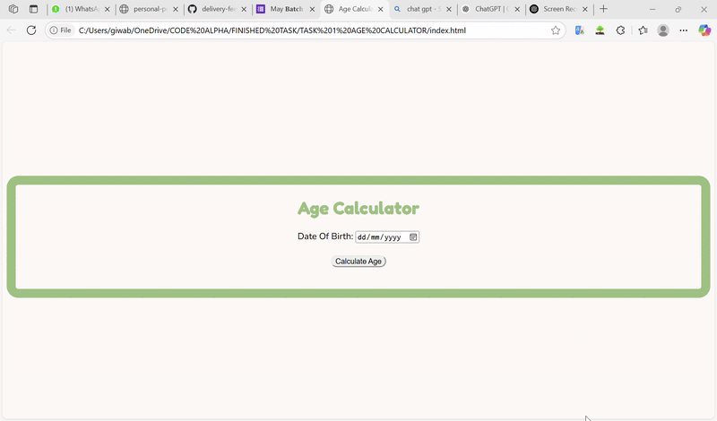

Overview

It is a web app is a frontend for calculating human age. It was built with CSS, JavaScript and HTML. It calculate human age based on the date of birth inputted by the user. This is the first task for Web development at CodeAlpha internship.

Project Preview.

##Installation

Follow the steps below

1. Copy the git url into your browser
2. Once the user interphase pops up
3. input your date of birth
4. click the calculate Age botton to get your age.

##Tech Stack Used
Javascript
HTML
CSS

##Author

Mariam Bidemi Araba Giwa

https://github.com/Giwa15

https://www.linkedin.com/in/mariam-araba-giwa-72068232a/

##Inputs and IDs
Based on the features required, the specified attributes has been incoporated in the input element and in the elements responsible for displaying human age.

Date of Birth: <input
          type="date"
          id="dob"
          placeholder="YYYY-MM-DD"
          required
        />

Calculate Age: <button type="submit">Calculate Age</button>
